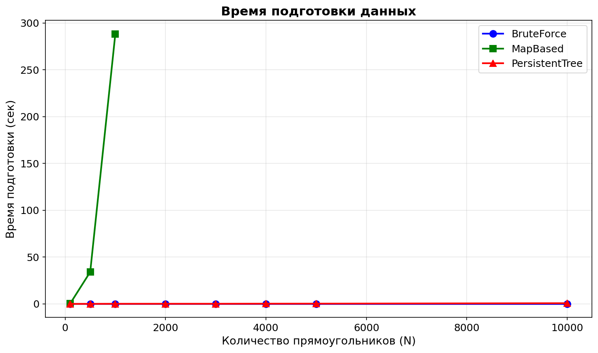
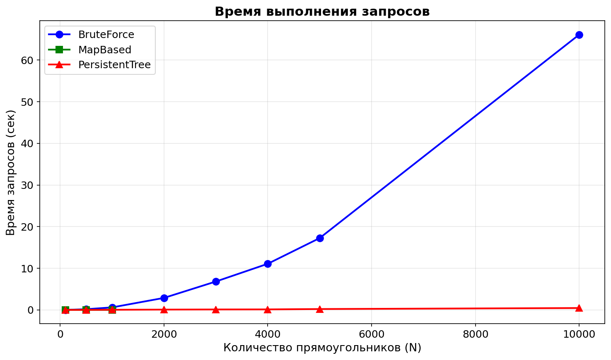

## Генерация данных  

Прямоугольники: генерировались вложенными друг в друга с координатами (10 * i, 10 * i, 10 * (2N-i), 10 * (2N-i))

Точки запросов: генерировались неслучайным образом через хэш-функции от индекса i с разным базисом для x и y: (p * i)^31 % (20 * N), где p - большое простое число

---

## Методика измерений

- Таймер: time.perf_counter()
- Параметры: для каждого значения N (от 100 до 10000) генерировалось Q = 10 * N запросов
- Алгоритмы: Brute Force, Map Based (сжатие координат), Persistent Segment Tree
- Ограничения: из-за кубической сложности препроцессинга O(N^3) алгоритм Map Based не запускался для N > 4000
- Оси графиков: по X - количество прямоугольников N, по Y - время в секундах

---

## Результаты по графикам

### 1) Время подготовки (Preprocessing Time)

- MapBased - самый медленный препроцессинг, время растет экспоненциально (согласно O(N^3))
- PersistentTree - демонстрирует стабильный рост O(N * log N)
- BruteForce не требует препроцессинга

---

### 2) Время поиска (Query Time)

- BruteForce - улетает вверх, время растет линейно
- MapBased - самый быстрый поиск O(log N), время почти не растет
- PersistentTree - сопоставим с MapBased по скорости поиска O(log N)

---

## Итог

1. Если данных мало (N < 500), BruteForce допустим из-за отсутствия подготовки, но на больших объемах он абсолютно непригоден
2. MapBased выигрывает по скорости поиска, но его препроцессинг O(N^3) делает невозможной работу с выборками
3. Persistent Segment Tree - самый сбалансированный алгоритм: умеренное время подготовки и стабильно быстрый поиск на любых дистанциях

---

## NB

Алгоритм на карте был принудительно остановлен на N=4000, так как при N=5000 расчетное время подготовки превысило бы разумные пределы тестирования. На графиках поиска заметны колебания - это нормальный системный шум при замерах малых интервалов времени.
